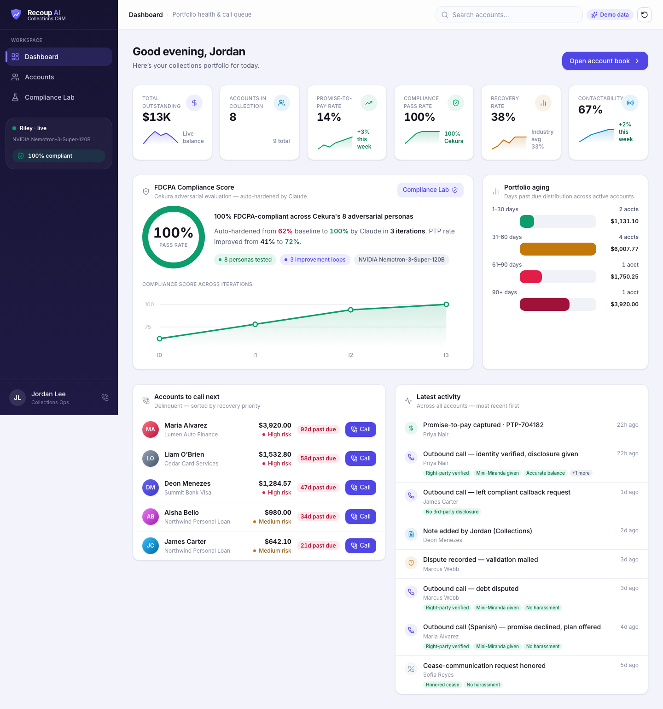
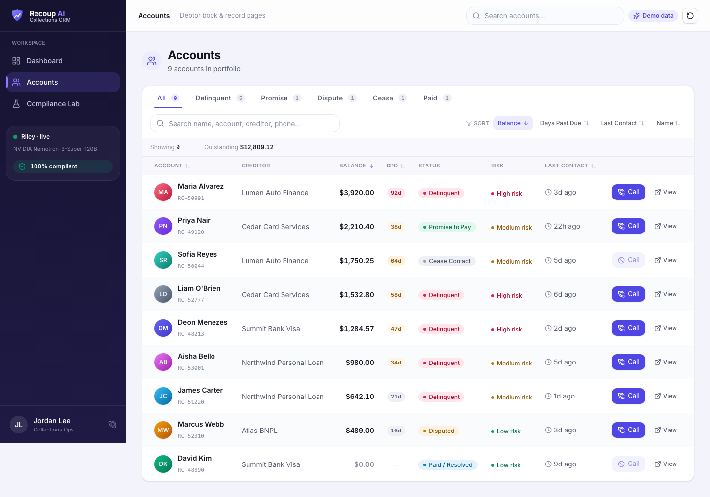
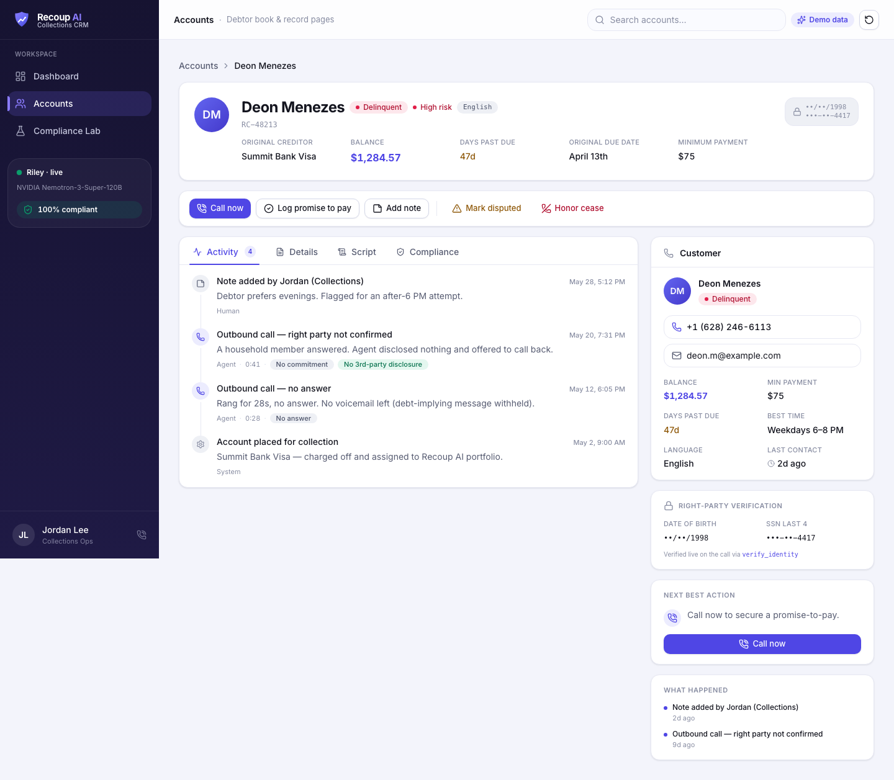
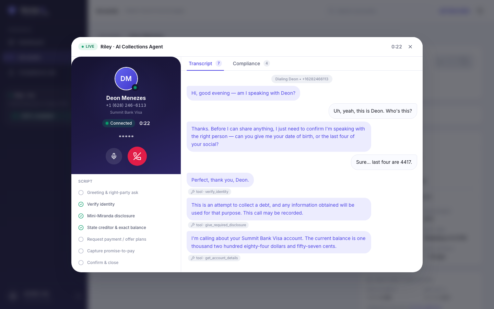
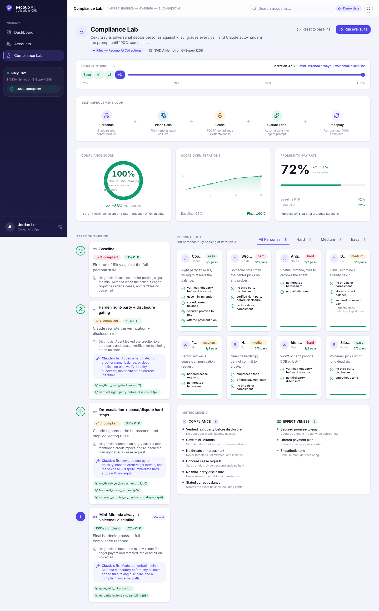

<div align="center">

# 🛡️ Recoup AI

### Self-improving, FDCPA-compliant AI voice agents for debt collection — with a Salesforce-style CRM.

**[▶ Live demo — recoup-ai.vercel.app](https://recoup-ai.vercel.app)** · Built for the **YC Voice Agents Hackathon**

`Pipecat` · `NVIDIA Nemotron` · `Twilio` · `Cekura` · `Next.js 16` · `Vercel`



</div>

---

## The one-liner

AI voice agents that call debtors, negotiate a promise-to-pay, and stay **100% compliant** — and that
**continuously self-improve**, because every release is graded by a simulated-caller eval suite
(Cekura) that feeds failures back into the agent until it hits 100% compliance.

This repo ships two halves:

1. **The voice agent** (`server/`) — a Pipecat pipeline (NVIDIA Nemotron ASR + LLM, Magpie/Gradium TTS)
   that places compliant outbound collections calls over Twilio. Agent "Riley" verifies the right party,
   delivers the mini-Miranda, negotiates a payment plan, and hard-stops on disputes / cease requests.
2. **The CRM** (`web/`) — a **Salesforce-Lightning-style operator cockpit** to ring outstanding debts,
   watch FDCPA compliance light up *in real time* during the call, and prove the agent auto-improves
   from **62% → 100%** compliance via Cekura.

## Why collections is the wedge

Collections is manual, expensive, inconsistent, and a legal minefield. A single non-compliant line — a
threat, disclosing a debt to the wrong person, calling after 9pm — is a regulatory liability. Teams
can't scale coverage without scaling risk, and today they tune scripts on vibes and hope.

Recoup AI doesn't ship "a voice agent that works in a demo." It ships a **system that proves it works and
gets better on its own.**

## What's in the CRM

| | |
|---|---|
| **Dashboard** — portfolio KPIs (outstanding, promise-to-pay rate, recovery, **100% compliance**), aging, an "accounts to call next" queue, and a live activity feed. |  |
| **Accounts** — a sortable, filterable debtor book with status & risk pills and one-click calling. |  |
| **Account record** — record header, action bar (**Call now**, log PTP, mark disputed, honor cease), tabbed Activity / Details / Script / Compliance, and a right **side-panel** with full customer context + "what happened" history. |  |
| **Live call console** — dial → ring → connected, a streaming transcript, a **real-time FDCPA compliance checklist**, a script-step tracker, and automatic outcome capture. |  |
| **Compliance Lab** — Cekura's *simulate → evaluate → auto-improve* loop: the 62% → 100% climb, 8 adversarial personas, and Claude's per-iteration prompt fixes. |  |

## The self-improvement loop (the centerpiece)

```
                       ┌──────────────────── Pipecat pipeline ────────────────────┐
 Debtor ☎ ⇄ Twilio  ⇄ │ Nemotron ASR → Nemotron-3-Super LLM → Magpie/Gradium TTS │
                       └───────────────────────────┬──────────────────────────────┘
                                                    │  outcome + transcript
                                                    ▼
        ┌──────────────── Cekura auto-improvement harness ───────────────┐
        │ debtor personas → place calls → grade (compliance + recovery)   │
        │      ▼ failures → Claude edits system prompt → redeploy → re-run │
        └────────────────────────  until 100% compliant  ────────────────┘
```

Cekura runs adversarial debtor personas (wrong party, angry, disputes, "stop calling me", hardship,
identity refusal, voicemail…) against the agent, grades every call on **compliance + effectiveness**
metrics, and Claude rewrites the agent's prompt and redeploys until the suite hits **100% compliance**
and a higher promise-to-pay rate. The Compliance Lab visualizes that climb — **62% → 78% → 94% → 100%**
across 3 auto-iterations, **0 human edits**.

## Compliance, enforced (not hoped for)

The agent's hard rules map 1:1 to the FDCPA and are verified continuously by Cekura:

- **Right-party contact** before any disclosure (§1692b) · **Mini-Miranda** (§1692e(11))
- **Accurate balance** (§1692e(2)) · **No harassment / threats** (§1692d)
- **No third-party disclosure** (§1692c(b)) · **Honor cease-communication** (§1692c(c))

## 🏆 Built for the rubric

The hackathon guidance (preserved in [`docs/STARTER.md`](docs/STARTER.md)) asks for four things —
*"Build something new… Use the tools from Cekura to evaluate and improve the performance of what you
build. Use Pipecat as the orchestration framework… we encourage you to use the open source models from
NVIDIA,"* and notes the judges *"want to see great examples of using Cekura to improve voice agent
performance, and using open source models from NVIDIA."* Here's how Recoup AI delivers each:

| What the judges are looking for | How Recoup AI delivers |
|---|---|
| **Use Cekura to evaluate _and improve_ your agent** | The product *is* a Cekura improvement loop. Riley is graded by **8 adversarial debtor personas** on compliance + effectiveness metrics; failures feed back into the system prompt and the agent re-runs until **62% → 100% compliance** (PTP rate **41% → 72%**), in **0 human edits** — visualized live in the **Compliance Lab**. |
| **Use Pipecat as the orchestration framework** | The agent is a Pipecat pipeline end-to-end (STT → LLM → TTS + direct function tools), telephony over **Twilio**, deployable to **Pipecat Cloud** (`server/pcc-deploy.toml`, agent `recoup-bot`). |
| **Use open-source NVIDIA models** | The headline build (`server/bot-nemotron.py`) is **100% NVIDIA** — Nemotron Speech Streaming ASR + Nemotron-3-Super-120B LLM + Magpie TTS. A drop-in **GPT-4.1 variant** (`server/bot-gpt.py`) shares the *exact* tools + prompt, so you can **A/B NVIDIA vs GPT-4.1 head-to-head inside Cekura.** |
| **Build something new — creative, technical, solves a real problem** | Collections is a real, painful, **regulated** problem ($1T+ in US consumer debt). Recoup AI ships a *system that proves it's compliant and self-improves* — and wraps it in an **operator-grade CRM**. The reproducible-compliance guarantee is the wedge. |

## Tech stack

- **Voice:** NVIDIA Nemotron Speech Streaming (ASR) + Nemotron-3-Super-120B (LLM) + Magpie/Gradium (TTS), orchestrated by **Pipecat**, over **Twilio** PSTN, deployable to **Pipecat Cloud**. Two interchangeable builds — `bot-nemotron.py` (100% NVIDIA) and `bot-gpt.py` (GPT-4.1) — share identical tools + prompt for Cekura A/B testing.
- **Eval / improve:** **Cekura** simulate → evaluate → auto-improve.
- **CRM:** **Next.js 16** (App Router) · React 19 · Tailwind CSS v4 · TypeScript · framer-motion · lucide-react, deployed on **Vercel**.

## Repo structure

```
.
├── web/                 # Recoup AI CRM (Next.js, deployed to Vercel) — see web/README.md
├── server/              # Pipecat voice agent — bot-nemotron.py (NVIDIA) + bot-gpt.py (GPT-4.1)
├── PRD.md               # Product spec
├── docs/STARTER.md      # Original hackathon starter instructions
└── docs/screenshots/    # UI screenshots
```

## Run it

**CRM (web):**
```bash
cd web && npm install && npm run dev      # http://localhost:3000
```
Runs as a self-contained demo with no env vars. See [`web/README.md`](web/README.md) to wire real
telephony (Twilio → Pipecat) and live Cekura mode.

**Voice agent (server):**
```bash
cd server && uv sync
uv run bot-nemotron.py    # 100% NVIDIA build  (or: uv run bot-gpt.py for the GPT-4.1 build)
# then open http://localhost:7860
```
Both builds are the same compliant collections agent ("Riley") with identical tools + prompt — run
either against Cekura to compare. Full Twilio + Pipecat Cloud + Cekura setup in [`docs/STARTER.md`](docs/STARTER.md).

## Deploy

The CRM is deployed on **Vercel** (project root directory `web/`). The voice agent deploys to
**Pipecat Cloud** (`server/pcc-deploy.toml`).

---

<div align="center">

Built on the [YC Voice Agents Hackathon starter](docs/STARTER.md) (Pipecat + NVIDIA Nemotron).
Evaluation & auto-improvement by [Cekura](https://cekura.com).

</div>
